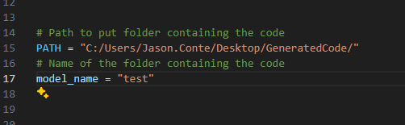
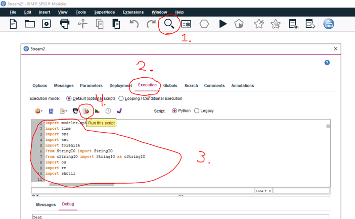

# spss-to-python
Code to convert an SPSS stream to pyspark code

## Requirements
Each of the following versions are what I used. Other versions may work also
- SPSS version: 18.2.1
- Python version: 3.8.5
- Pyspark version: 3.0.1

## How To

1. Open SPSS_Python_Converter_cleaned.py
2. Change line 15 to point to the folder the code will be stored. Line 17 is the folder name

3. Copy the contents of SPSS_Python_Converter_cleaned.py
4. Open the SPSS Modeller stream you would like to convert
5. Click on the Magnifying Glass, then Execution
6. Delete the contents of the Execution window and paste the whole file in
7. Click the 'Run this script' button

8. The code will be in the path you specified in line 15

## Data
- `SPSS_Python_Converter_cleaned.py`: The python file that converts the SPSS stream. Paste it into the Execution window within SPSS
- `Parent_config_CLOUD.py`: config variables used after code is generated
- `/helpers`: helper functions used after code is generated
- `/_TEMPLATE`: templates that are automatically copied into project folder on first run
    - `config.json`: config variables used by SPSS_Python_Converter_cleaned.py to dictate how SPSS is converted
    - `ManualCodeMap.py`: map to hijack conversion of specific nodes with custom python code
- `/example`: examples of how to use config.json and ManualCodeMap.py. Usage is optional